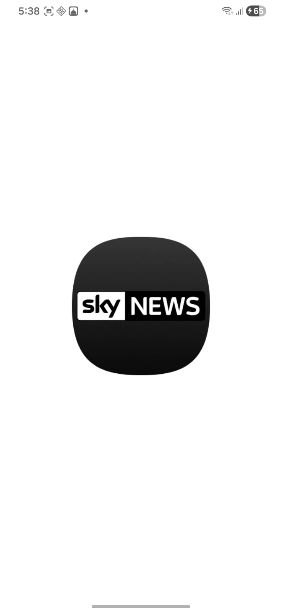

# SkyNews - Kotlin Multiplatform News App

  
  
  

## 📱 About

**SkyNews** is a comprehensive and interactive cross-platform news application built completely with Kotlin Multiplatform (KMP) and Compose Multiplatform (CMP). The app provides real-time top headlines and business news using NewsAPI, featuring an elegant UI that runs seamlessly on both Android and iOS devices.

## 📸 Screenshots

  
  
  
  
  
  

## ✨ Features

- 📰 **Real-Time News** - Get the latest top headlines and business news instantly
- 📱 **Cross-Platform UI** - Fully built with Compose Multiplatform, sharing 100% of the UI across Android and iOS
- 💾 **Local Caching** - View saved and cached news articles without internet access
- 🎨 **Beautiful UI** - Clean, modern, and highly responsive user interface
- 🏗️ **Clean Architecture** - Structured with Domain, Data, and Presentation layers for maximum scalability

## 🛠️ Technologies Used

- **UI Framework**: [Compose Multiplatform](https://www.jetbrains.com/lp/compose-multiplatform/)
- **Architecture**: MVVM + Clean Architecture principles
- **Asynchrony**: Kotlin Coroutines & Flow
- **Dependency Injection**: [Koin](https://insert-koin.io/)
- **Network**: [Ktor](https://ktor.io/) + [NewsAPI](https://newsapi.org/)
- **Local Database**: [Room (SQLite Bundled)](https://developer.android.com/training/data-storage/room)
- **Image Loading**: [Coil3](https://coil-kt.github.io/coil/)
- **Navigation**: [Jetbrains Navigation Compose](https://www.jetbrains.com/help/kotlin-multiplatform-dev/compose-navigation-routing.html)